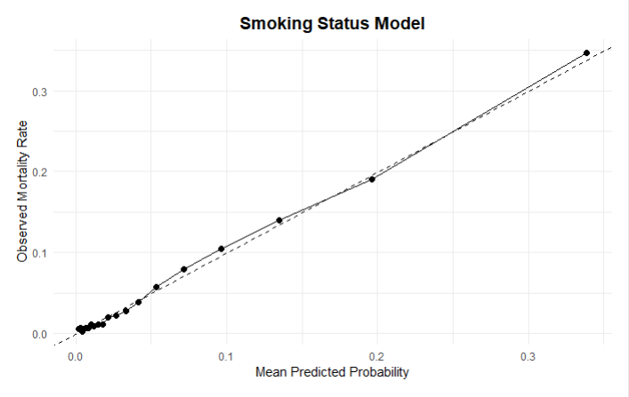
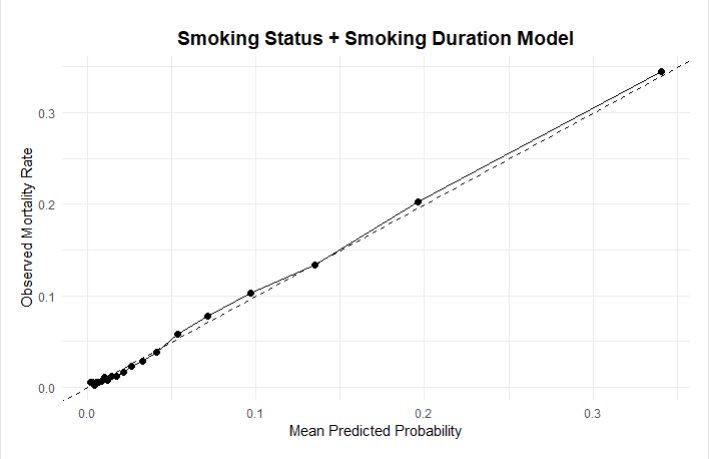

```{r setup, include=FALSE, message=FALSE, warning=FALSE}
# Set global chunk options for the document
knitr::opts_chunk$set(
  echo = FALSE,      # do not show code by default
  message = FALSE,   # suppress messages from library() or other functions
  warning = FALSE    # suppress warnings
)
```


# Predicting Mortality Risk from Cigarette Smoking Using Machine Learning and Interpretable Statistical Models

## Abstract

### Background

Cigarette smoking is a major contributor to preventable mortality worldwide, yet substantial heterogeneity exists in smoking behaviors and associated health risks. Accurately predicting mortality risk across diverse smoking profiles is critical for effective risk stratification and targeted intervention. While traditional statistical models offer interpretability, they are often not optimized for predictive performance, whereas machine learning approaches emphasize risk prediction but may lack transparency

### Objective

The goal of this study is to develop and evaluate predictive models for mortality risk associated with cigarette smoking, prioritizing accurate risk stratification and subsequently using statistical models to provide interpretable insights into key risk factors.

# Dataset

Data Acquisition and Description The National Longitudinal Mortality Study (NLMS) Public Use Microdata Sample (PUMS) Tobacco Use Cohort (dataset filename : tu) contains 493,282 participants who were tracked over a five year period. Forty-three different variables including demographic information, socioeconomic factors, and smoking behaviors were collected for each individual. Importantly, the death indicator column (`inddea` = 1 if deceased, 0 otherwise)) reported whether an individual was alive or deceased at the end of the follow up period. Data was acquired from the NIH-Biologic Specimen and Data Repository Information Coordinating Center under request number 17175 and used for this analysis.

# Exposures and Covariates

The main exposures of interest were:\
1. Smoking status (smokstat), categorized as never, everyday, some-days, or former smokers.\
2. Smoking duration, operationalized using age at smoking initiation (agesmk).

Additional covariates included age, sex, race/ethnicity (race), marital status (ms_recode), health insurance status (histatus), and adjusted income (adjinc). Categorical covariates were encoded as factors for model inclusion.

# Predictive Modeling Approach:

## Methods

Data Splitting: The cohort was divided into training (≈70%) and test (≈30%) subsets. Observations with missing predictor values were removed prior to model fitting to ensure valid probability estimation. Model Specification: Two logistic regression–based predictive models were developed:

**MODEL 1:** Smoking Status

$$
\text{logit}\big[P(\text{Death}_i = 1)\big] 
= \beta_0 
+ \beta_1\,\text{Smokestat}_i
+ \beta_2\,\text{Age}_i
+ \beta_3\,\text{Race}_i
+ \beta_4\,\text{Sex}_i
+ \beta_5\,\text{Insurance}_i
+ \beta_6\,\text{Income}_i
+ \beta_7\,\text{MaritalStatus}_i 
$$

**MODEL 2:** Smoking Status + Smoking Duration

$$
\text{logit}\big[P(\text{Death}_i = 1)\big] = \gamma_0 + \gamma_1\,\text{Smokestat}_i + \gamma_2\,\text{AgeStartedSmoking}_i + \gamma_3\,\text{Age}_i + \gamma_4\,\text{Race}_i
$$

$$         
         + \gamma_5\,\text{Sex}_i + \gamma_6\,\text{Insurance}_i + \gamma_7\,\text{Income}_i + \gamma_8\,\text{MaritalStatus}_i
$$

Prediction and Risk Stratification: Predicted probabilities were generated for the test dataset using the predict() function with type = "response". Individuals were ranked based on predicted mortality risk, and high-risk groups were defined at the top 10% percentiles.

### 5-Fold Cross Validation Results:

| Model                  | ROC        | Sensitivity | Specificity |
|------------------------|------------|-------------|-------------|
| Smoking Status Model   | 0.8461     | 0.9986      | 0.0307      |
| Smoking Duration Model | **0.8465** | 0.9985      | **0.0345**  |

-   **ROC (AUC)** =\~ 0.85 → The models have **excellent discrimination**, meaning it can rank individuals from low to high mortality risk quite well.

-   **Sensitivity** \~ 0.999 → The models are **almost perfect at identifying deaths** (True Positive Rate)

-   **Specificity** = 0.03 → Very low, meaning it **misclassifies many survivors as deaths** (False Positive Rate is high).

    **Note:** This is expected if your dataset is **highly imbalanced**, e.g., deaths are a small fraction of total samples. Logistic regression tends to predict the **majority class poorly for specificity** unless you handle class imbalance.

### Evaluation Metrics:

Discrimination: Area under the receiver operating characteristic curve (AUC) using the pROC package. DeLong’s test was used to compare AUCs between models.


The AUCs of SmokingStatus model`rocCV1` (0.852) and SmokingStatus + SmokingDuration model `rocCV2` (0.853) are very similar, and the small but statistically significant difference (p ≈ 3.44e-5) indicates `rocCV2` has a slightly higher discriminatory performance.

The models have **excellent discrimination**, it can rank individuals from low to high mortality risk quite well

### Model Calibration





Model calibration was evaluated using grouped (decile-based) calibration analysis. Predicted probabilities were divided into equal-frequency bins, and observed event rates were calculated within each bin. Manual binning was chosen due to the large sample size and imbalanced outcome distribution, which can lead to instability in nonparametric smoothing approaches (e.g., LOESS), particularly in extreme probability ranges. Grouped calibration provides stable estimation of observed risk, improves interpretability, and aligns with recommended practices for reporting clinical prediction models. Both models demonstrated good overall calibration, with low Brier scores (Model 1: 0.0447; Model 2: 0.0446), indicating accurate probability estimation. The inclusion of smoking duration yielded only marginal improvement in overall prediction error.

# Statistical Modeling for Interpretation

To complement prediction, logistic regression models were used for effect estimation and interpretability:

Coefficients were exponentiated to generate odds ratios (ORs) with 95% confidence intervals.

Model fit was evaluated using Akaike Information Criterion (AIC) and Bayesian Information Criterion (BIC).

Differences in model fit and predictive performance were interpreted in the context of smoking behavior (status and duration) and demographic covariates, providing insight into the key determinants of mortality risk.

```{r}

final_table_indent <- readRDS("final_table_indent.rds")

# Now you can use it in your Rmd document
#final_table_indent

### making an elegant table

library(knitr)
library(kableExtra)
library(dplyr)

final_table_indent1 <- final_table_indent %>%
  mutate(
    Level = ifelse(is.na(Level), "&nbsp;&nbsp;&nbsp;&nbsp;NA",
           paste0("&nbsp;&nbsp;&nbsp;&nbsp;", Level))  # <-- indentation
  )
final_table_indent2 <- final_table_indent1 %>%
  mutate(
    Male = ifelse(is.na(Male), "", Male),
    Female = ifelse(is.na(Female), "", Female)
  )
N_male = 230967
N_female = 262315
final_table_indent2 %>%
  arrange(Variable, Level) %>%
  kable(
    format = "html",
    caption = paste0(
      "Table 1. Descriptive Statistics Stratified by Sex<br>",
      "<i>Male (N = ", format(N_male, big.mark=","), 
      ") & Female (N = ", format(N_female, big.mark=","), ")</i>"
    ),
    col.names = c("Variable", "Level", "Male", "Female"),
    escape = FALSE
  ) %>%
  kable_styling(
    bootstrap_options = c("striped", "hover", "condensed"),
    full_width = FALSE,
    position = "center",
   font_size = 12
  ) %>%
  collapse_rows(columns = 1, valign = "top")%>%
  footnote(
    general = "1 n (%); Mean (SD)",
    general_title = "",
    footnote_as_chunk = TRUE
  )
```

```{r}

### Interpretation Tables


library(kableExtra)

table_interpretation <- data.frame(
  Predictor = c(
    "Everyday smoker (vs never)", 
    "Some-days smoker (vs never)", 
    "Former smoker (vs never)",
    "Age (per year)",
    "Race:Black (vs White)",
    "Race:American Indian/Alaskan Native (vs White)",
    "Race:Asian/Pacific Islander(vs White)",
    "Race: Other (vs White)",
    "Female (vs Male)",
    "Insured (vs Uninsured)",
    "Income (per level increase)",
    "Married (vs Separated/Not married)"
  ),
  Interpretation = c(
    "119% higher mortality (OR=2.19)",
    "78% higher mortality (OR=1.78)",
    "37% higher mortality (OR=1.37)",
    "9% increase in mortality per year (OR=1.09)",
    "24% higher mortality (OR=1.24)",
    "38% higher mortality (OR=1.38)",
    "26% lower mortality (OR=0.74)",
    "Not significant",
    "43% lower mortality (OR=0.57)",
    "17% higher mortality (OR=1.17)",
    "5% lower mortality per income level (OR=0.95)",
    "27% lower mortality (OR=0.73)"
  )
)

table_interpretation %>%
  kable(
    format = "html",
    caption = "Interpretation of Adjusted Odds Ratios for Mortality:Smoking Status",
   col.names = c("Predictor", "Interpretation"),
   escape = FALSE
  ) %>%
  kable_styling(
    bootstrap_options = c("striped", "hover"),
    full_width = FALSE,
    position = "center"
  )

```

```{r}
library(kableExtra)

table_model7 <- data.frame(
  Predictor = c(
    "Someday smoker (vs Everyday Smoker)",
    "Former smoker (vs Everyday Smoker)",
    "Age started smoking (per year)",
    "Age (per year)",
    "Race:Black (vs White)",
    "Race:American Indian/Alaskan Native (vs White)",
    "Race:Asian/Pacific Islander(vs White)",
    "Race: Other (vs White)",
    "Female (vs Male)",
    "Health insurance: Yes (vs No)",
    "Income (per level)",
    "Married (vs Seperated/Not married)"
  ),
  Interpretation = c(
    "13.7% lower mortality (OR = 0.86)",
    "38.8% lower mortality (OR = 0.61)",
    "2.1% lower mortality per year started later (OR = 0.98)",
    "9.4% higher mortality per year of age (OR = 1.09)",
    "14.7% higher mortality (OR = 1.15)",
    "27.9% higher mortality (OR = 1.28)",
    "30.0% lower mortality (OR = 0.70)",
    "Not significant (OR = 0.97)",
    "35.7% lower mortality for females (OR = 0.64)",
    "19.4% higher mortality (OR = 1.19)",
    "5.9% lower mortality per income level (OR = 0.94)",
    "22.4% lower mortality for married individuals (OR = 0.78)"
  )
)

table_model7 %>%
  kable(
    format = "html",
    caption = "Interpretation of Adjusted Odds Ratios: Smoking Status + Duration Model",
    col.names = c("Predictor", "Interpretation"),
    escape = FALSE
  ) %>%
  kable_styling(
    bootstrap_options = c("striped", "hover", "condensed"),
    full_width = FALSE,
    position = "center"
  )

```

### Comparison of the Models


