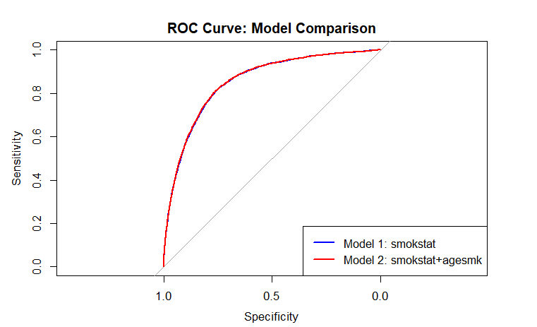
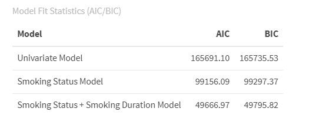

```{r setup, include=FALSE, message=FALSE, warning=FALSE}
# Set global chunk options for the document
knitr::opts_chunk$set(
  echo = FALSE,      # do not show code by default
  message = FALSE,   # suppress messages from library() or other functions
  warning = FALSE    # suppress warnings
)
```

# Predicting Mortality Risk from Cigarette Smoking Using Machine Learning and Interpretable Statistical Models

## Background

Cigarette smoking is a major contributor to preventable mortality worldwide, yet substantial heterogeneity exists in smoking behaviors and associated health risks. Accurately predicting mortality risk across diverse smoking profiles is critical for effective risk stratification and targeted intervention. While traditional statistical models offer interpretability, they are often not optimized for predictive performance, whereas machine learning approaches emphasize risk prediction but may lack transparency

## Objective

The goal of this study is to develop and evaluate predictive models for mortality risk associated with cigarette smoking, prioritizing accurate risk stratification and subsequently using statistical models to provide interpretable insights into key risk factors.

## Data Acquisition and Description

 
The National Longitudinal Mortality Study (NLMS) Public Use Microdata Sample (PUMS) Tobacco Use Cohort (dataset filename : tu) contains 493,282 participants who were tracked over a five year period. Forty-three different variables including demographic information, socioeconomic factors, and smoking behaviors were collected for each individual. Importantly, the death indicator column (`inddea` = 1 if deceased, 0 otherwise)) reported whether an individual was alive or deceased at the end of the follow up period. Data was acquired from the NIH-Biologic Specimen and Data Repository Information Coordinating Center under request number 17175 and used for this analysis.

## Exposures and Covariates

The main exposures of interest were:\
1. Smoking status (smokstat), categorized as never, everyday, some-days, or former smokers.\
2. Smoking duration, operationalized using age at smoking initiation (agesmk).

Additional covariates included age, sex, race/ethnicity (race), marital status (ms_recode), health insurance status (histatus), and adjusted income (adjinc). Categorical covariates were encoded as factors for model inclusion.

## Data Processing Efficiency Evaluation

### Methods

To assess computational efficiency for large-scale modeling, we benchmarked three data ingestion methods in R: base R (read.csv), data.table::fread, and Apache Arrow with Parquet format. Using the NLMS Tobacco Use dataset (\~493,000 observations; 43 variables), we compared runtime, memory allocation, and garbage collection frequency using the bench package. Each method was evaluated across three iterations to ensure stable performance estimates. For the Arrow-based approach, the dataset was read via open_dataset() and materialized in memory using collect(), with outputs standardized as data frames for comparability.

### Results

```{r}

library(knitr)
library(kableExtra)

benchmark_table <- data.frame(
  Method = c("read_csv", "fread", "arrow_parquet"),
  Runtime = c("2.86 s", "73.86 ms", "147.14 ms"),
  Memory = c("578 MB", "176 MB", "164 MB"),
  GC = c(6, 2, 1)
)

kable(benchmark_table,
      caption = "Benchmark Comparison of Data Loading Methods",
      align = "c") %>%
  kable_styling(
    bootstrap_options = c("striped", "hover", "condensed"),
    full_width = FALSE
  )

```

Compared to base R (read.csv):

-   fread achieved approximately 97% reduction in runtime and \~70% reduction in memory allocation.

-   Arrow/Parquet achieved approximately 95% reduction in runtime and \~72% reduction in memory allocation.

-   Arrow also required the fewest garbage collection cycles, indicating improved memory efficiency.

These findings demonstrate that modern data-processing frameworks substantially improve computational efficiency for large healthcare datasets. While fread exhibited the fastest runtime, Arrow/Parquet provided superior memory efficiency and scalable infrastructure benefits, making it well suited for high-volume predictive modeling workflows.

## Predictive Modeling 

### Methods

Data Splitting: The cohort was divided into training (≈70%) and test (≈30%) subsets. Observations with missing predictor values were removed prior to model fitting to ensure valid probability estimation.

Model Specification: Two logistic regression–based predictive models were developed:

**MODEL 1:** Smoking Status

$$
\text{logit}\big[P(\text{Death}_i = 1)\big] 
= \beta_0 
+ \beta_1\,\text{Smokestat}_i
+ \beta_2\,\text{Age}_i
+ \beta_3\,\text{Race}_i
+ \beta_4\,\text{Sex}_i
+ \beta_5\,\text{Insurance}_i
+ \beta_6\,\text{Income}_i
+ \beta_7\,\text{MaritalStatus}_i 
$$

**MODEL 2:** Smoking Status + Smoking Duration

$$
\text{logit}\big[P(\text{Death}_i = 1)\big] = \gamma_0 + \gamma_1\,\text{Smokestat}_i + \gamma_2\,\text{AgeStartedSmoking}_i + \gamma_3\,\text{Age}_i + \gamma_4\,\text{Race}_i
$$

$$         
         + \gamma_5\,\text{Sex}_i + \gamma_6\,\text{Insurance}_i + \gamma_7\,\text{Income}_i + \gamma_8\,\text{MaritalStatus}_i
$$

Prediction and Risk Stratification: Predicted probabilities were generated for the test dataset using the predict() function with type = "response". Individuals were ranked based on predicted mortality risk, and high-risk groups were defined at the top 5%, 10% and 20% percentiles.

### Results

#### 5-Fold Cross Validation

| Model                  | ROC        | Sensitivity | Specificity |
|------------------------|------------|-------------|-------------|
| Smoking Status Model   | 0.8461     | 0.9986      | 0.0307      |
| Smoking Duration Model | **0.8465** | 0.9985      | **0.0345**  |

-   **ROC (AUC)** =\~ 0.85 → The models have **excellent discrimination**, meaning it can rank individuals from low to high mortality risk quite well.

-   **Sensitivity** \~ 0.999 → The models are **almost perfect at identifying deaths** (True Positive Rate)

-   **Specificity** = 0.03 → Very low, meaning it **misclassifies many survivors as deaths** (False Positive Rate is high).

    **Note:** This is expected if dataset is **highly imbalanced**, e.g., deaths are a small fraction of total samples. Logistic regression tends to predict the **majority class poorly for specificity** unless class imbalance is handled.

#### Evaluation Metrics

Discrimination: Area under the receiver operating characteristic curve (AUC) using the pROC package. DeLong’s test was used to compare AUCs between models.



The AUCs of SmokingStatus model`rocCV1` (0.852) and SmokingStatus + SmokingDuration model `rocCV2` (0.853) are very similar, and the small but statistically significant difference (p ≈ 3.44e-5) indicates `rocCV2` has a slightly higher discriminatory performance.

The models have **excellent discrimination**, it can rank individuals from low to high mortality risk quite well

### Risk Stratification and Lift Analysis

To evaluate the practical utility of the predictive models for targeted risk identification, lift analysis was conducted on the held-out test dataset. Predicted probabilities were ranked in descending order, and individuals were grouped into percentile-based risk segments (e.g., top 5%, 10%, and 20%).

Lift analysis evaluates how effectively a predictive model concentrates events (e.g., mortality) within the highest predicted risk groups compared to the overall population. Lift was calculated as the ratio of the observed mortality rate within a selected high-risk percentile group to the overall mortality rate in the test population:

$$
\text{Lift} = \frac{\text{Mortality in Top Group}}{\text{Overall Mortality}}
$$

This approach quantifies the degree to which the model concentrates mortality risk within the highest predicted probability groups relative to random selection. Lift curves were generated by computing lift values across incremental risk percentiles (1–50%), providing a visual assessment of risk concentration and stratification performance.

```{r}
library(dplyr)
library(kableExtra)

lift_table <- data.frame(
  Model = c(
    "Smoking Status",
    "Smoking Status",
    "Smoking Status",
    "Smoking + Duration",
    "Smoking + Duration",
    "Smoking + Duration"
  ),
  Percentile = c("Top 5%", "Top 10%", "Top 20%",
                 "Top 5%", "Top 10%", "Top 20%"),
  Baseline_Rate = c("5.50%", "5.50%", "5.50%",
                    "5.50%", "5.50%", "5.50%"),
  Event_Rate_Top = c("34.61%", "26.82%", "19.50%",
                     "34.42%", "27.33%", "19.57%"),
  Lift = c(6.29, 4.88, 3.54,
           6.26, 4.97, 3.56)
)

lift_table %>%
  kable(
    caption = "Lift Analysis for Mortality Risk Prediction Models",
    align = "c",
    booktabs = TRUE
  ) %>%
  kable_styling(
    bootstrap_options = c("striped", "hover", "condensed"),
    full_width = FALSE,
    position = "center"
  ) %>%
  collapse_rows(columns = 1, valign = "middle")
```


Lift analysis demonstrated strong risk stratification performance. The top 10% highest predicted risk individuals exhibited approximately five-fold higher mortality compared to the overall population, with even greater concentration observed in the top 5% risk group.

#### Model Calibration

Model calibration was evaluated using grouped (decile-based) calibration analysis. Predicted probabilities were divided into equal-frequency bins, and observed event rates were calculated within each bin. Manual binning was chosen due to the large sample size and imbalanced outcome distribution, which can lead to instability in nonparametric smoothing approaches (e.g., LOESS), particularly in extreme probability ranges. Grouped calibration provides stable estimation of observed risk, improves interpretability, and aligns with recommended practices for reporting clinical prediction models. Both models demonstrated good overall calibration, with low Brier scores (Model 1: 0.0447; Model 2: 0.0446), indicating accurate probability estimation. The inclusion of smoking duration yielded only marginal improvement in overall prediction error.


## Statistical Modeling for Interpretation

### Methods

To complement prediction, logistic regression models were used for effect estimation and interpretability:

Coefficients were exponentiated to generate odds ratios (ORs) with 95% confidence intervals.

Model fit was evaluated using Akaike Information Criterion (AIC) and Bayesian Information Criterion (BIC).

Differences in model fit and predictive performance were interpreted in the context of smoking behavior (status and duration) and demographic covariates, providing insight into the key determinants of mortality risk.

```{r}

final_table_indent <- readRDS("final_table_indent.rds")

# Now you can use it in your Rmd document
#final_table_indent

### making an elegant table

library(knitr)
library(kableExtra)
library(dplyr)

final_table_indent1 <- final_table_indent %>%
  mutate(
    Level = ifelse(is.na(Level), "&nbsp;&nbsp;&nbsp;&nbsp;NA",
           paste0("&nbsp;&nbsp;&nbsp;&nbsp;", Level))  # <-- indentation
  )
final_table_indent2 <- final_table_indent1 %>%
  mutate(
    Male = ifelse(is.na(Male), "", Male),
    Female = ifelse(is.na(Female), "", Female)
  )
N_male = 230967
N_female = 262315
final_table_indent2 %>%
  arrange(Variable, Level) %>%
  kable(
    format = "html",
    caption = paste0(
      "Table 1. Descriptive Statistics Stratified by Sex<br>",
      "<i>Male (N = ", format(N_male, big.mark=","), 
      ") & Female (N = ", format(N_female, big.mark=","), ")</i>"
    ),
    col.names = c("Variable", "Level", "Male", "Female"),
    escape = FALSE
  ) %>%
  kable_styling(
    bootstrap_options = c("striped", "hover", "condensed"),
    full_width = FALSE,
    position = "center",
   font_size = 12
  ) %>%
  collapse_rows(columns = 1, valign = "top")%>%
  footnote(
    general = "1 n (%); Mean (SD)",
    general_title = "",
    footnote_as_chunk = TRUE
  )
```

### Results

```{r}

### Interpretation Tables
## Smoking Status Model

library(kableExtra)

table_interpretation <- data.frame(
  Predictor = c(
    "Everyday smoker (vs never)", 
    "Some-days smoker (vs never)", 
    "Former smoker (vs never)",
    "Age (per year)",
    "Race:Black (vs White)",
    "Race:American Indian/Alaskan Native (vs White)",
    "Race:Asian/Pacific Islander(vs White)",
    "Race: Other (vs White)",
    "Female (vs Male)",
    "Insured (vs Uninsured)",
    "Income (per level increase)",
    "Married (vs Separated/Not married)"
  ),
  Interpretation = c(
    "119% higher mortality (OR=2.19)",
    "78% higher mortality (OR=1.78)",
    "37% higher mortality (OR=1.37)",
    "9% increase in mortality per year (OR=1.09)",
    "24% higher mortality (OR=1.24)",
    "38% higher mortality (OR=1.38)",
    "26% lower mortality (OR=0.74)",
    "Not significant",
    "43% lower mortality (OR=0.57)",
    "17% higher mortality (OR=1.17)",
    "5% lower mortality per income level (OR=0.95)",
    "27% lower mortality (OR=0.73)"
  ),
  p_vlaue =c(
    "<0.001",
    "<0.001",
    "<0.001",
    "<0.001",
    "<0.001",
    "<0.001",
    "<0.001",
    "0.449",
    "0.0331",
    "<0.001",
    "<0.001",
    "<0.001"
  )
)

table_interpretation %>%
  kable(
    format = "html",
    caption = "Table 2: Interpretation of Adjusted Odds Ratios for Mortality:Smoking Status",
   col.names = c("Predictor", "Interpretation", "p-value"),
   escape = FALSE
  ) %>%
  kable_styling(
    bootstrap_options = c("striped", "hover"),
    full_width = FALSE,
    position = "center"
  )


```

```{r}
# Smoking Status + Smoking Duration Model

library(kableExtra)

table_model7 <- data.frame(
  Predictor = c(
    "Someday smoker (vs Everyday Smoker)",
    "Former smoker (vs Everyday Smoker)",
    "Age started smoking (per year)",
    "Age (per year)",
    "Race:Black (vs White)",
    "Race:American Indian/Alaskan Native (vs White)",
    "Race:Asian/Pacific Islander(vs White)",
    "Race: Other (vs White)",
    "Female (vs Male)",
    "Health insurance: Yes (vs No)",
    "Income (per level)",
    "Married (vs Seperated/Not married)"
  ),
  Interpretation = c(
    "13.7% lower mortality (OR = 0.86)",
    "38.8% lower mortality (OR = 0.61)",
    "2.1% lower mortality per year started later (OR = 0.98)",
    "9.4% higher mortality per year of age (OR = 1.09)",
    "14.7% higher mortality (OR = 1.15)",
    "27.9% higher mortality (OR = 1.28)",
    "30.0% lower mortality (OR = 0.70)",
    "Not significant (OR = 0.97)",
    "35.7% lower mortality for females (OR = 0.64)",
    "19.4% higher mortality (OR = 1.19)",
    "5.9% lower mortality per income level (OR = 0.94)",
    "22.4% lower mortality for married individuals (OR = 0.78)"
  ),
  
  p_vlaue =c(
    "0.00949",
    "<0.001",
    "<0.001",
    "<0.001",
    "0.00234",
    "0.0331",
    "0.00212",
    "0.883",
    "<0.001",
    "0.00131",
    "<0.001",
    "<0.001"
  )
)

table_model7 %>%
  kable(
    format = "html",
    caption = "Table 3: Interpretation of Adjusted Odds Ratios: Smoking Status + Duration Model",
    col.names = c("Predictor", "Interpretation","p-value"),
    escape = FALSE,
  ) %>%
  kable_styling(
    bootstrap_options = c("striped", "hover", "condensed"),
    full_width = FALSE,
    position = "center"
  )


```

#### Smoking Status Model

In multivariable logistic regression analysis, smoking status was strongly associated with mortality after adjustment for demographic and socioeconomic covariates. Compared with never smokers, everyday smokers had more than twice the odds of mortality (OR = 2.19, p \< 0.001), while some-days smokers (OR = 1.78, p \< 0.001) and former smokers (OR = 1.37, p \< 0.001) also exhibited significantly elevated risk.

Age was independently associated with mortality, with a 9% increase in odds per additional year of age (OR = 1.09, p \< 0.001). Female sex was associated with significantly lower mortality compared to males (OR = 0.57, p = 0.033). Higher income and being married were protective factors, whereas being insured was associated with modestly higher mortality risk. Race-specific associations varied, with some minority groups exhibiting elevated risk relative to White participants.

#### Smoking Status + Smoking Duration Model

When age at smoking initiation was incorporated into the model, significant risk differentiation was observed within smoking categories. Compared with everyday smokers, former smokers had 38.8% lower odds of mortality (OR = 0.61, p \< 0.001), and some-days smokers had 13.7% lower odds (OR = 0.86, p = 0.009). Additionally, each additional year delay in smoking initiation was associated with a 2.1% reduction in mortality risk (OR = 0.98, p \< 0.001).

Age remained a strong independent predictor (OR ≈ 1.09 per year, p \< 0.001). Female sex, higher income, and marriage continued to demonstrate protective associations. Race-related effects remained generally consistent with the primary model.

### Model Fit Comparison



Model fit improved substantially with the inclusion of smoking duration. The Smoking Status + Smoking Duration model demonstrated markedly lower information criteria values (AIC = 49,666.97; BIC = 49,795.82) compared to the Smoking Status model (AIC = 99,156.09; BIC = 99,297.37) and the univariate model (AIC = 165,691.10; BIC = 165,735.53). These reductions indicate improved explanatory performance and model fit when incorporating smoking initiation age.

## Discussion

This study demonstrates the value of integrating machine learning–based prediction with traditional statistical modeling to evaluate mortality risk associated with cigarette smoking. By combining these complementary approaches, we were able to achieve both strong predictive performance and clear epidemiologic interpretability.

From a predictive standpoint, the machine learning framework (cross-validated logistic classification models evaluated using ROC/AUC, calibration, and lift analysis) provided robust discrimination of mortality risk. The models achieved strong performance (AUC ≈ 0.85), indicating effective ranking of individuals according to risk. Risk percentile analysis further demonstrated the ability to identify high-risk subgroups, supporting potential applications in targeted public health intervention, clinical decision support, and population risk stratification. These strengths reflect the primary advantage of machine learning approaches: optimizing predictive accuracy and generalization performance, particularly in large-scale datasets.

However, predictive performance alone does not explain why risk differs across groups. This is where statistical modeling plays a critical role. The multivariable logistic regression models provided interpretable effect estimates (odds ratios) that quantified the independent contribution of smoking status, age at smoking initiation, and other covariates. These results offer actionable insights into the magnitude of smoking-related mortality risk and clarify the protective or adverse effects of demographic and socioeconomic factors. Statistical models thus enhance transparency, interpretability, and scientific understanding — elements that are essential for clinical, regulatory, and public health decision-making.

The integration of smoking duration into the model further illustrates the advantage of combining approaches. While predictive metrics showed modest incremental gains in discrimination, the statistical interpretation revealed meaningful reductions in mortality risk associated with delayed smoking initiation and smoking cessation. Such findings highlight how interpretability complements predictive evaluation by contextualizing model improvements in clinically meaningful terms.

Additionally, the use of scalable data engineering methods (Arrow/Parquet) substantially reduced computational burden, enabling efficient cross-validation and iterative modeling on a large healthcare dataset. This demonstrates that methodological rigor in both modeling and infrastructure is necessary to support reproducible, high-dimensional predictive analysis.

In summary, machine learning and statistical modeling should not be viewed as competing paradigms, but rather as complementary tools. Machine learning optimizes predictive performance and supports risk stratification at scale, while statistical modeling provides interpretability, effect estimation, and inferential clarity. Together, these approaches enable accurate, explainable, and actionable mortality risk assessment in large population datasets.
